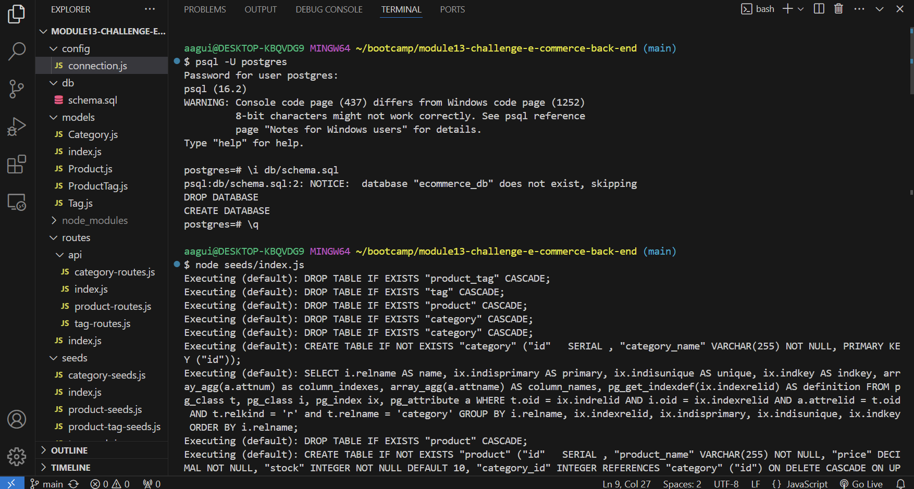
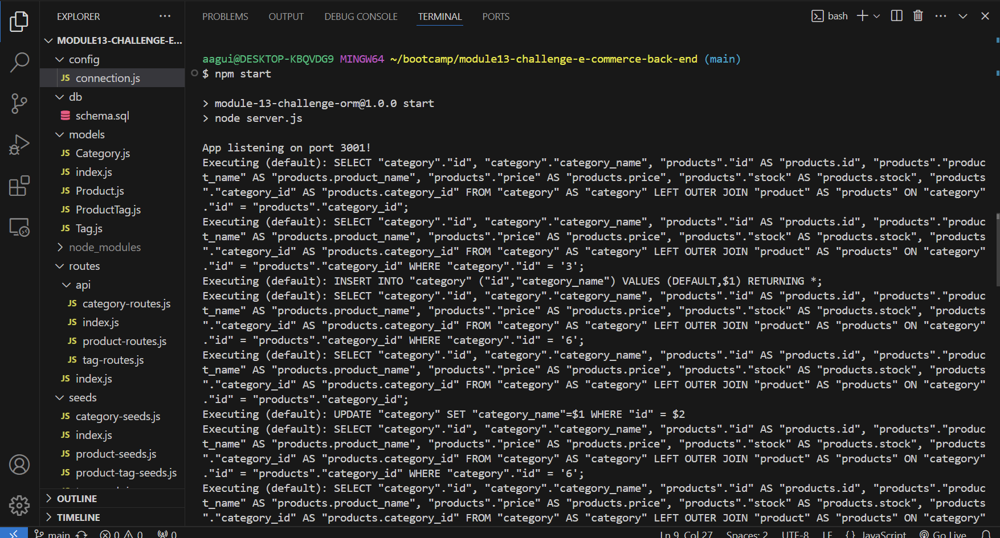

# E-Commerce Back End

### Creating the back end of an e-commerce website with Javascript, PostgreSQL, Sequelize, and Insomnia

## Table of Contents

[Project Status](#project-status)

[Media of Application](#media-for-application)

[Purpose](#purpose)

[Installation](#installation)

[Usage](#usage)

[Credits](#credits)

[License](#license)

[Contributing](#contributing)

[Tests](#tests)

[Questions](#questions)

## Project Status

**Completed**

[GitHub Repository](https://github.com/aaguimond/module13-challenge-e-commerce-back-end)

[Live E-Commerce Back End](N/A)

## Media for Application

[A link to a video demonstrating the functionality of the application](https://drive.google.com/file/d/1fFVFX_ZzuZYCMwi-cgYE4DpP2wmVi8sJ/view)

## Purpose

To demonstrate my ability to create a fully functional back end for a hypothetical e-commerce website.

## Installation

To install the project, a user would need to download or clone the repository. Run a terminal within the directory folder and type "npm install" to install the packages for the application. Log in to postgres or other SQL application. Initialize the schema file by typing "\i db/schema.sql" in the SQL program shell. Once successful, exit the SQL shell and navigate back to the terminal. Seed the database by typing "node seeds/index.js" in the terminal. Start the server by typing "npm start". Once successful, you're ready to use any api routes within this application.

## Usage

This application supports all CRUD methods. Please see the [video above](#media-for-application) to see specific usage examples.

## Credits

* Node.js
* npm
* Sequelize
* PostgreSQL
* Insomnia

## License

This project is licensed under the [ISC](https://opensource.org/licenses/ISC) license.

## Contributing

Please feel free to use the code within the boundaries of the [license](#license). You can also reach me [below](#questions) with any questions.

## Tests

N/A

## Questions

Please reach out to me with any questions:

- Github: [aaguimond](https://github.com/aaguimond)
- Email: aidanguimond2024@u.northwestern.edu
